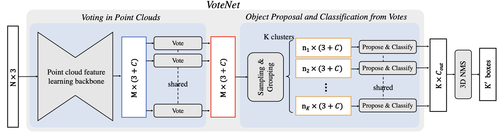

# Detection & Relocalization based on VoteNet

3D Object Detection and Relocalization using VoteNet in dataset [3RScan](https://github.com/WaldJohannaU/3RScan).

  

> [**3D Object Detection and Relocalization in Indoor Scenes**](https://github.com/xiongyiheng/xiongyiheng.github.io/blob/main/report/3D_Object_Detection_and_Relocalization_in_Indoor_Scenes.pdf),            
> Yiheng Xiong, Jingsong Liu

## Installation
1. download the dataset (3RScan).
2. refer [readme](https://github.com/facebookresearch/votenet#readme) of original VoteNet repo to install all dependencies.

## Acknowledgement

Our code is based on [VoteNet](https://github.com/facebookresearch/votenet). Thanks Meta AI for their awesome codebases.
